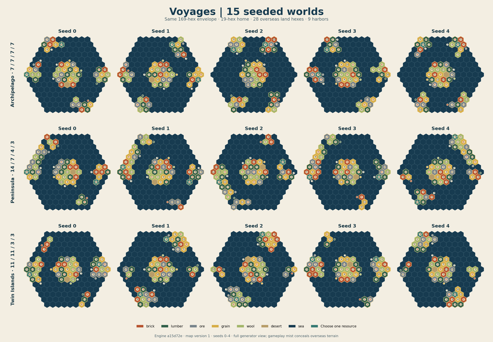

# Verified map gallery

This replaces the earlier gallery with actual exports from the frozen generator
at engine commit `a15d72e42689cf95aa7e2bd042830286990ae74f`, map version 1.
The later `81bb29c` save-validation change does not alter generation. Rows show
Archipelago, Peninsula and Twin Islands; columns show seeds 0 through 4.
The diagram is an omniscient generation study. Gameplay mist hides undiscovered
terrain, resources and ports.

The [fifteen original JSONs](map-samples/archipelago-0.json),
[SHA256 manifest](gallery_manifest.csv), [generation log](map-generation-study.log),
[summary](map_study_summary.csv), [economy](map_study_economy.csv) and
[routes](map_study_routes.csv) preserve the underlying evidence. The manifest
lists each sample. [The renderer](render-map-gallery.py) uses Matplotlib 3.7.2;
running it reproduces the diagram from these exports without regenerating worlds.

| Family | Seeds studied | Distinct coordinate geometries | Fallbacks observed | Mean attempts |
|---|---:|---:|---:|---:|
| Archipelago | 1,000 | 1,000 | 0 | 3.361 |
| Peninsula | 1,000 | 994 | 0 | 4.430 |
| Twin Islands | 1,000 | 998 | 0 | 3.634 |

These counts include rotated and reflected layouts; they do not count distinct
topologies after removing orientation. Every normal world passed geometry,
component separation, connected-sea, coastal capacity, reachable-interior,
resource/token histogram, production-adjacency and port validation. All four
fog/resource-choice settings preserved geometry, tokens, ordinary resources,
ports, development deck and final RNG state for each of 1,000 seeds per family.
The explicit same-family fallback passed all 72 combinations of family,
rotation, reflection and resource-choice option. Zero observed fallbacks is a
sample result, not a promise that every seed succeeds on its first attempts.

The shapes produce different settlement problems: four comparable destinations
in Archipelago; a large crescent or branched coast with smaller satellites in
Peninsula; two substantial fronts and two small opportunities in Twin Islands.
The fixed home, sea moat and outer land belt constrain geography deliberately.
They keep every starting harbor supplied with at least two destinations within
six sea steps and every island interior discoverable from the sea. They also
make the four overseas sectors recognizable across games; this is controlled
variation rather than unconstrained continental geography.

Across 120,000 harbor/destination pairs per family, the median route was five
steps. The 90th percentile was eight steps for Archipelago and Twin Islands,
and nine for Peninsula. Roughly 34–36% of destinations fit one three-step turn;
68–69% fit two. Remote destinations can require ten steps. These are shortest
routes from launch sea to an island coast, before turn timing or strategic detours.

Every island offered a best coastal landing worth 6–9 production pips. Total
production still varied: seven-hex islands ranged from 13 to 30 pips in
Archipelago; three-hex satellites from 7 to 14; eleven-hex islands from 24 to 44;
and fourteen-hex peninsulas from 34 to 53. Resource specialties and total yield
remain varied, while a coastal 6/8 prevents tiny islands becoming uniformly poor
expeditions. Pips measure dice frequency and do not price the extra flexibility
of choosing a resource; economic and AI conclusions require match evidence.
